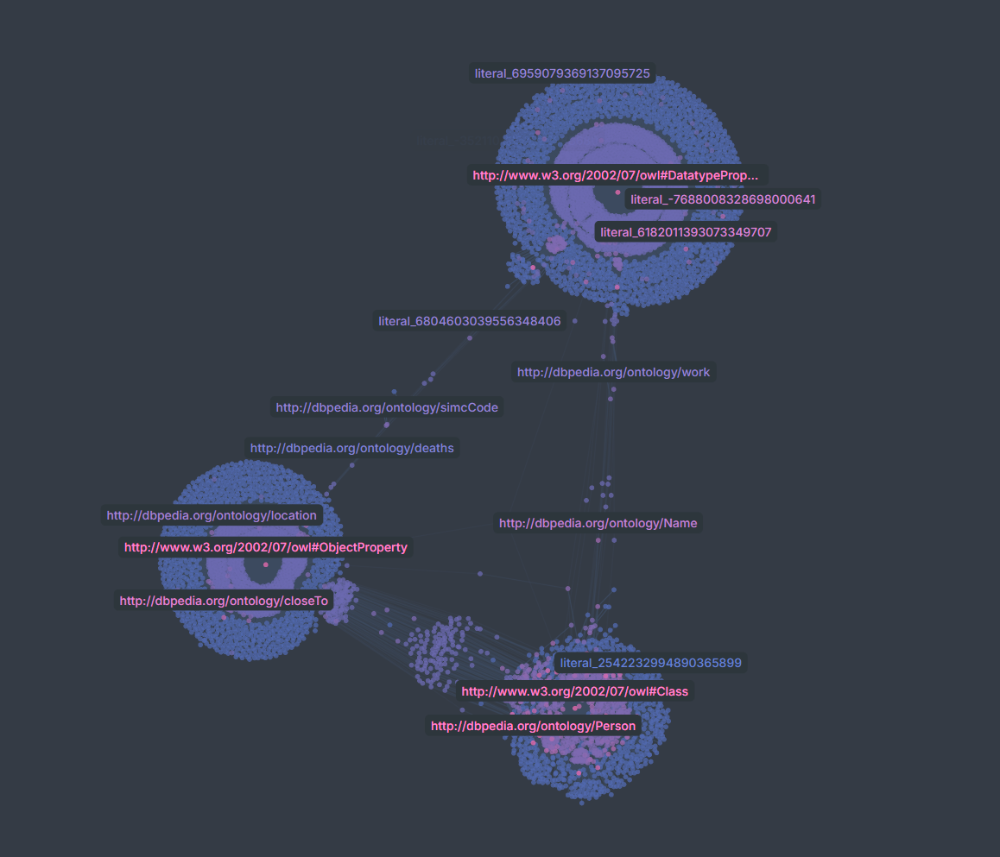

# RDF TTL to CSV Converter for Network Visualization

This tool converts RDF Turtle (.ttl) ontology files (like DBpedia) into CSV format suitable for network visualization tools such as Gephi, Cytoscape, or web-based visualization libraries.


*Example visualization of DBpedia ontology structure generated from this tool*

## Table of Contents

- [Features](#features)
- [Installation](#installation)
- [Usage](#usage)
  - [Command Line Usage](#command-line-usage)
  - [Programmatic Usage](#programmatic-usage)
- [Output Files](#output-files)
  - [Graph Edges File](#1-graph-edges-file-_edgescsv)
  - [Node Metadata File](#2-node-metadata-file-_nodescsv)
  - [Statistics File](#3-statistics-file-_statisticstxt)
- [Visualization Integration](#visualization-integration)
  - [For Gephi](#for-gephi)
  - [For Cytoscape](#for-cytoscape)
  - [For Web Visualization](#for-web-visualization-d3js-visjs-etc)
- [Filtering Options](#filtering-options)
  - [Predicate Filtering](#predicate-filtering)
  - [Common DBpedia Predicates](#common-dbpedia-predicates)
- [Node Type Color Scheme](#node-type-color-scheme)
- [Performance Considerations](#performance-considerations)
- [Examples](#examples)
  - [Example 1: DBpedia Person Networks](#example-1-dbpedia-person-networks)
  - [Example 2: Ontology Structure](#example-2-ontology-structure)
  - [Example 3: Geographic Networks](#example-3-geographic-networks)
- [Complete Use Case Example: DBpedia Ontology Visualization](#complete-use-case-example-dbpedia-ontology-visualization)
  - [Files in This Example](#files-in-this-example)
  - [Using with Cosmograph](#using-with-cosmograph-cosmographapp)
  - [Visualization Result](#visualization-result)
  - [Generated Network Statistics](#generated-network-statistics)
  - [Reproducing This Example](#reproducing-this-example)
- [Troubleshooting](#troubleshooting)
  - [Common Issues](#common-issues)
  - [Getting Help](#getting-help)
- [Quick Reference: Using with Cosmograph](#quick-reference-using-with-cosmograph)
- [License](#license)

## Features

- **Graph Edges**: Extracts subject-predicate-object relationships as network edges
- **Node Metadata**: Generates node properties including labels, types, colors, and sizes
- **Flexible Filtering**: Option to filter by specific predicates or relationship types
- **Skip Unlabeled Nodes**: Option to skip nodes without RDFS/SKOS labels for cleaner visualization
- **Statistics**: Provides detailed conversion statistics and summaries
- **Color Coding**: Automatic color assignment based on node types
- **Size Scaling**: Node sizes based on degree (number of connections)
- **Complete Example**: Includes DBpedia ontology sample with visualization (see `dbpedia_example.png`)

## Installation

1. Install Python dependencies:
```bash
pip install -r requirements.txt
```

Required packages:
- `rdflib>=6.0.0` - For parsing RDF/TTL files
- `pandas>=1.3.0` - For CSV generation and data manipulation

## Usage

### Command Line Usage

```bash
# Basic conversion
python rdf_to_csv_converter.py input_file.ttl

# With output directory
python rdf_to_csv_converter.py input_file.ttl -o output_directory

# Include literal values as nodes
python rdf_to_csv_converter.py input_file.ttl --include-literals

# Filter specific predicates
python rdf_to_csv_converter.py input_file.ttl --filter-predicates rdf:type rdfs:subClassOf

# Custom output filenames
python rdf_to_csv_converter.py input_file.ttl --edges-file custom_edges.csv --nodes-file custom_nodes.csv
```

### Programmatic Usage

```python
from rdf_to_csv_converter import RDFToCSVConverter

# Basic conversion
converter = RDFToCSVConverter('dbpedia_sample.ttl')
edges_file, nodes_file = converter.convert()

# Advanced options
converter = RDFToCSVConverter('dbpedia_sample.ttl', output_dir='network_data')
edges_file, nodes_file = converter.convert(
    include_literals=False,
    filter_predicates=['rdf:type', 'rdfs:subClassOf', 'dbo:birthPlace'],
    edges_filename='relationships.csv',
    nodes_filename='entities.csv'
)

# Skip nodes without RDFS/SKOS labels for cleaner visualization
converter = RDFToCSVConverter('ontology.ttl')
edges_file, nodes_file = converter.convert(
    skip_unlabeled=True,  # Only include nodes with proper labels
    edges_filename='clean_edges.csv',
    nodes_filename='clean_nodes.csv'
)

# Get statistics
stats = converter.generate_statistics()
print(f"Converted {stats['total_edges']} edges and {stats['total_nodes']} nodes")
```

## Output Files

### 1. Graph Edges File (*_edges.csv)

Contains the network relationships with the following columns:

| Column | Description | Required for Visualization |
|--------|-------------|---------------------------|
| `source` | Source node URI | ✅ Required |
| `target` | Target node URI | ✅ Required |
| `source_label` | Human-readable source label | ❌ Optional |
| `target_label` | Human-readable target label | ❌ Optional |
| `predicate` | Full predicate URI | ❌ Optional |
| `predicate_label` | Human-readable predicate label | ❌ Optional |
| `edge_type` | Edge type for styling | ❌ Optional |

Example:
```csv
source,target,source_label,target_label,predicate,predicate_label,edge_type
http://dbpedia.org/resource/Albert_Einstein,http://dbpedia.org/ontology/Person,Albert Einstein,Person,http://www.w3.org/1999/02/22-rdf-syntax-ns#type,type,type
http://dbpedia.org/resource/Albert_Einstein,http://dbpedia.org/resource/Ulm,Albert Einstein,Ulm,http://dbpedia.org/ontology/birthPlace,birth place,birth place
```

### 2. Node Metadata File (*_nodes.csv)

Contains node properties for visualization styling:

| Column | Description | Use for Visualization |
|--------|-------------|----------------------|
| `id` | Node URI (matches source/target in edges) | ✅ Required |
| `label` | Human-readable node label | Node labels |
| `type` | Node type/category | Grouping/filtering |
| `color` | Hex color code | Node coloring |
| `size` | Numeric size value | Node sizing |
| `degree` | Number of connections | Alternative sizing |

Example:
```csv
id,label,type,color,size,degree
http://dbpedia.org/resource/Albert_Einstein,Albert Einstein,Person,#DDA0DD,25,3
http://dbpedia.org/ontology/Person,Person,Class,#FF6B6B,45,12
http://dbpedia.org/resource/Ulm,Ulm,City,#98D8C8,15,2
```

### 3. Statistics File (*_statistics.txt)

Contains conversion summary and analysis.

## Visualization Integration

### For Gephi
1. Import the edges CSV as "Data Table" 
2. Import the nodes CSV as "Nodes Table"
3. Use the `color` column for node coloring
4. Use the `size` column for node sizing
5. Use the `type` column for grouping/filtering

### For Cytoscape
1. Import edges CSV as "Network"
2. Import nodes CSV as "Node Attributes"
3. Map visual properties to the metadata columns

### For Web Visualization (D3.js, vis.js, etc.)
The CSV files can be easily converted to JSON format for web-based visualizations.

## Filtering Options

### Predicate Filtering
Filter by specific relationship types:

```python
# Only structural relationships
structural_predicates = [
    'rdf:type',
    'rdfs:subClassOf', 
    'rdfs:subPropertyOf',
    'owl:equivalentClass'
]

# Only DBpedia domain relationships
domain_predicates = [
    'dbo:birthPlace',
    'dbo:deathPlace', 
    'dbo:spouse',
    'dbo:occupation'
]
```

### Common DBpedia Predicates
- `rdf:type` - Entity classification
- `dbo:birthPlace` - Birth location
- `dbo:deathPlace` - Death location
- `dbo:spouse` - Marriage relationships
- `dbo:occupation` - Professions
- `dbo:location` - Geographic relationships
- `rdfs:label` - Human-readable names

## Node Type Color Scheme

The converter automatically assigns colors based on node types:

| Node Type | Color | Hex Code |
|-----------|-------|----------|
| Class | Red | #FF6B6B |
| Property | Teal | #4ECDC4 |
| Individual | Blue | #45B7D1 |
| Person | Plum | #DDA0DD |
| Place | Green | #98D8C8 |
| Organization | Yellow | #F7DC6F |
| Event | Purple | #BB8FCE |
| Unknown | Gray | #BDC3C7 |

## Performance Considerations

- **Large Files**: For files with millions of triples, consider filtering by predicates
- **Memory Usage**: The converter loads the entire graph into memory
- **Literals**: Including literals (`--include-literals`) significantly increases node count
- **Output Size**: Use predicate filtering to reduce output file sizes

## Examples

### Example 1: DBpedia Person Networks
```python
# Extract person-related networks from DBpedia
converter = RDFToCSVConverter('dbpedia_persons.ttl')
edges_file, nodes_file = converter.convert(
    filter_predicates=[
        'rdf:type',
        'dbo:birthPlace',
        'dbo:deathPlace',
        'dbo:spouse',
        'dbo:child',
        'dbo:parent'
    ]
)
```

### Example 2: Ontology Structure
```python
# Extract just the ontological structure
converter = RDFToCSVConverter('ontology.ttl')
edges_file, nodes_file = converter.convert(
    filter_predicates=[
        'rdf:type',
        'rdfs:subClassOf',
        'rdfs:subPropertyOf',
        'owl:equivalentClass',
        'owl:equivalentProperty'
    ]
)
```

### Example 3: Geographic Networks
```python
# Extract geographic relationships
converter = RDFToCSVConverter('dbpedia_places.ttl')
edges_file, nodes_file = converter.convert(
    filter_predicates=[
        'rdf:type',
        'dbo:location',
        'dbo:country',
        'dbo:city',
        'dbo:region'
    ]
)
```

## Complete Use Case Example: DBpedia Ontology Visualization

This repository includes a complete example using DBpedia ontology data to demonstrate the conversion and visualization workflow.

### Files in This Example

- **Input**: `sparql_2025-07-17_07-56-39Z.ttl` - DBpedia ontology subset
- **Output**: 
  - `sparql_2025-07-17_07-56-39Z_edges.csv` - Graph relationships (8,454 edges)
  - `sparql_2025-07-17_07-56-39Z_nodes.csv` - Node metadata (3,807 nodes)
- **Visualization**: `dbpedia_example.png` - Sample network visualization

### Using with Cosmograph (cosmograph.app)

This example demonstrates how to use the generated files with Cosmograph, a web-based network visualization tool:

1. **Graph Data (Required)**: Upload `sparql_2025-07-17_07-56-39Z_edges.csv`
   - Contains source-target relationships
   - Includes edge labels and types for styling
   - 8,454 relationships showing ontology structure

2. **Graph Metadata (Optional)**: Upload `sparql_2025-07-17_07-56-39Z_nodes.csv`
   - Contains node styling information (colors, sizes, labels)
   - 3,807 entities with type-based color coding:
     - Classes (red): 788 nodes
     - DatatypeProperty (gray): 1,854 nodes  
     - ObjectProperty (gray): 1,164 nodes
   - Node sizes based on connection degree

### Visualization Result

The resulting visualization (see `dbpedia_example.png`) shows:
- **Ontology structure** with classes, properties, and their relationships
- **Type-based coloring** to distinguish entity types
- **Hierarchical layout** showing inheritance relationships
- **Interactive exploration** of the DBpedia ontology

### Generated Network Statistics

From the example conversion:
- **Total nodes**: 3,807 entities
- **Total edges**: 8,454 relationships
- **Node types**: Classes (788), DatatypeProperty (1,854), ObjectProperty (1,164)
- **Relationship types**: rdf:type, rdfs:subClassOf, rdfs:subPropertyOf, rdfs:label
- **Average degree**: 4.4 connections per node

### Reproducing This Example

```bash
# Convert the DBpedia ontology file
python rdf_to_csv_converter.py sparql_2025-07-17_07-56-39Z.ttl

# Files generated:
# - sparql_2025-07-17_07-56-39Z_edges.csv
# - sparql_2025-07-17_07-56-39Z_nodes.csv
# - sparql_2025-07-17_07-56-39Z_statistics.txt
```

Then upload the CSV files to your preferred visualization tool:
- **Cosmograph**: Upload edges.csv as main data, nodes.csv as metadata
- **Gephi**: Import edges as data table, nodes as node attributes
- **Cytoscape**: Load edges as network, nodes as node table

## Troubleshooting

### Common Issues

1. **"No module named 'rdflib'"**
   - Solution: Install dependencies with `pip install -r requirements.txt`

2. **"Error loading TTL file"**
   - Check file format and encoding
   - Ensure the file is valid Turtle syntax

3. **Empty output files**
   - Check if predicate filters are too restrictive
   - Verify the input file contains the expected data

4. **Memory errors with large files**
   - Use predicate filtering to reduce data size
   - Process files in smaller chunks

### Getting Help

Run the example script to see the converter in action:
```bash
python example_usage.py
```

This will create sample data and demonstrate the conversion process.

## Quick Reference: Using with Cosmograph

For the fastest setup with Cosmograph (cosmograph.app):

1. **Main Data File** (required): Upload your `*_edges.csv` file
   - Contains source and target columns for network structure
   
2. **Metadata File** (optional): Upload your `*_nodes.csv` file  
   - Provides node colors, sizes, and labels
   - Must have an `id` column matching the edges file

**Example with this repository:**
- Main Data: `sparql_2025-07-17_07-56-39Z_edges.csv`
- Metadata: `sparql_2025-07-17_07-56-39Z_nodes.csv`
- Result: Interactive DBpedia ontology network (see `dbpedia_example.png`)

## License

This project is licensed under the MIT License - see the [LICENSE](LICENSE) file for details.

This tool is provided for educational and research purposes.
